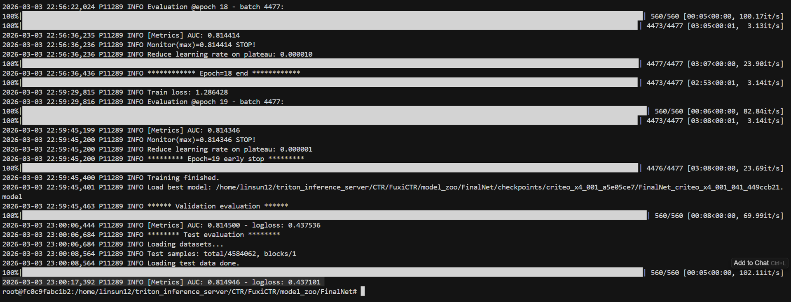
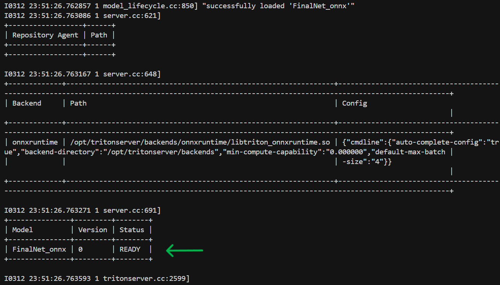

# Benchmark on FinalNet
## Overview
[FinalNet](#https://dl.acm.org/doi/10.1145/3539618.3591988) is a click-through rate (CTR) prediction model that achieves state-of-art performance on the Criteo_x4, Avazu_x1, and MovielensLatest_x1 datasets according to the [BARS leaderboard](#https://openbenchmark.github.io/BARS/index.html). 

In this tutorial, we walk through the steps required to benchmark the performance of the FinalNet model on AMD Instinct MI300X or MI355X

## Table of Contents
- Overview
- Prerequisites
- Model Training and Exporting to ONNX
- Model Config and Deployment on AMD Intrinsic GPUs
- Benchmarking
- Results

## Prerequisites
1. ROCm 7.2 installed on host machine
2. AMD Intrinsic MI355X or MI300X
3. Docker


## Model Training
1. Train FinalNet   
[How to train FinalNet on Criteo_x4 dataset](#https://github.com/reczoo/BARS/tree/main/ranking/ctr/FinalNet/FinalNet_criteo_x4_001)   
At the end of training you should see


2. Export model checkpoints to .onnx
```python
python export_finalnet_to_onnx.py \\
--checkpoint /path/to/model.model \\
--config-dir /workspace/BARS/.../FinalNet_criteo_x4_tuner_config_05 \\
--expid FinalNet_criteo_x4_001_041_449ccb21 \\
--output /path/to/model.onnx
```
Now we should have FinalNet model checkpoints in onnx.

## Model deployment on AMD MI300X or MI355X through Triton Inference Server
1. Build ROCm enabled tritonserver image with onnxruntime and python backend
```
git clone https://github.com/ROCm/triton-inference-server-server.git
# Follow README.md to build tritonserver docker image
```
2. Create model directory on host machine and copy FinalNet onnx checkpoints there
```bash
export MODEL_REPOSITORY=<Your model repository directory on host machine>
mkdir -p {$MODEL_REPOSITORY}/FinalNet_onnx/0
cp amd/config.pbtxt {$MODEL_REPOSITORY}/FinalNet_onnx
cp model.onnx {$MODEL_REPOSITORY}/FinalNet_onnx/0
```
3. Create migraphx cache directory on host machine
```
export MIGRAPHX_CACHE_DIR=<Your migraphx cache directory on host machine>
mkdir -p $MIGRAPHX_CACHE_DIR
```
4. Start tritonserver container
```bash
docker run \
  --name tritonserver_container \
  --device=/dev/kfd \
  --device=/dev/dri \
  --ipc=host \
  -it \
  -p 8000:8000 \
  -p 8001:8001 \
  -p 8002:8002 \
  --net=host \
  -e ORT_MIGRAPHX_MODEL_CACHE_PATH=/migraphx_cache \
  -e ORT_MIGRAPHX_CACHE_PATH=/migraphx_cache \
  -v ${MODEL_REPOSITORY}:/models \
  -v ${MIGRAPHX_CACHE_DIR}:/migraphx_cahe \
  tritonserver \
  tritonserver --model-repository=/models --exit-on-error=false
```
You should see FinalNet loaded successfully after launching tritonserver  



## Benchmarking

You can use perf_analyzer or create python script for end-to-end benchmark

```
perf_analyzer -m FinalNet_onnx  --input-data=random -b 8192 --concurrency-range 1:72:2
```
