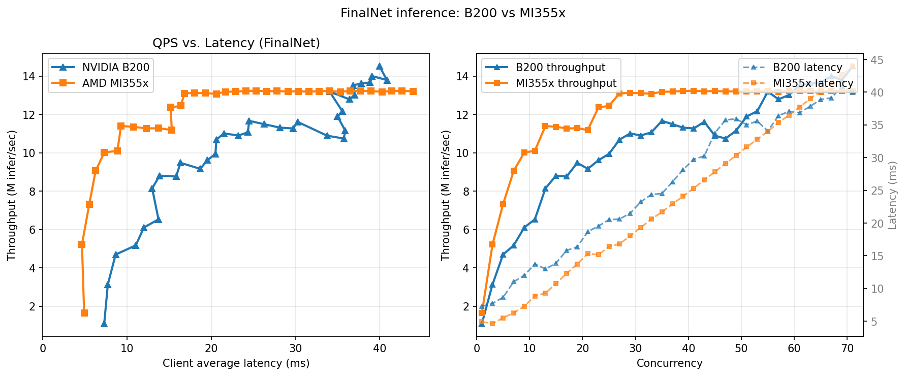
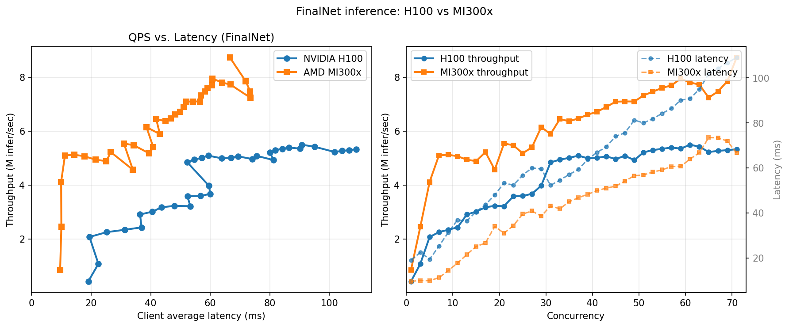

# Benchmark on FinalNet
## Overview
[FinalNet](#https://dl.acm.org/doi/10.1145/3539618.3591988) is a click-through rate (CTR) prediction model that achieves state-of-art performance on the Criteo_x4, Avazu_x1, and MovielensLatest_x1 datasets according to the [BARS leaderboard](#https://openbenchmark.github.io/BARS/index.html). 

In this tutorial, we walk through the steps required to benchmark the performance of the FinalNet model on both AMD Instinct MI355X and NVIDIA B200 GPUs. 

## Table of Contents
- Overview
- Prerequisites
- Model Training and Exporting to ONNX
- Model Config and Deployment on AMD Intrinsic GPUs
- Model Config and Deployment on NVIDIA GPUs
- Benchmarking
- Results

## Prerequisites
1. ROCm 7.2 installed on host machine
2. AMD Intrinsic MI355X or MI300X
3. NVIDIA B200 or H100
4. Docker


## Model Training on NVIDIA GPU
1. Pull pytorch container from NGC and start container
```
export WORKSPACE=<Your workspace directory on host>
docker pull nvcr.io/nvidia/pytorch:25.12-py3
docker run -d --runtime nvidia --gpus all  --cap-add=SYS_PTRACE --ipc=host --privileged=true \
        --shm-size=128GB --network=host --device=/dev/kfd \
        --device=/dev/dri --group-add video -it \
        -v $WORKSPACE:/workspace \
        --name train_CTR \
        nvcr.io/nvidia/pytorch:25.12-py3
```
1. inside the container, pull reczoo/BARS
```bash
cd /workspace
git clone https://github.com/reczoo/BARS.git
cd BARS/ranking/ctr/FinalNet/FinalNet_criteo_x4_001
```
2. inside the container, uses FuxiCTR to train FinalNet model, FuxiCTR can be insalled either using pip or pull source code
```bash
git clone -b v2.2.0 https://github.com/reczoo/FuxiCTR.git
cd FuxiCTR && pip install -r requirements.txt
```
3. inside the container, pull dataset repo
```bash
git clone https://github.com/reczoo/Datasets.git
```
4. inside the container, Create data directory
```bash
cd /workspace/FuxiCTR/model_zoo
mkdir -p ./data/Criteo/Criteo_x4 && cd ./data/Criteo/Criteo_x4
wget https://huggingface.co/datasets/reczoo/Criteo_x4/resolve/main/Criteo_x4.zip?download=true
unzip Criteo_x4.zip
```
5. inside the container, data config and model config files are under /workspace/BARS/ranking/ctr/FinalNet/FinalNet_criteo_x4_001/FinalNet_criteo_x4_tuner_config_05 use these config for training FinalNet on Criteo_x4 dataset
```bash
cd /workspace/FuxiCTR/model_zoo/FinalNet

PYTHONPATH="/workspace/FuxiCTR:$PYTHONPATH" python run_expid.py --config /workspace/BARS/ranking/ctr/FinalNet/FinalNet_criteo_x4_001/FinalNet_criteo_x4_tuner_config_05 --expid FinalNet_criteo_x4_001_041_449ccb21 --gpu 0 > run.log & tail -f run.log
```
6. By end of training you should see following AUC and logloss from testing data


7. inside the container, export model checkpoints to .onnx
```python
python export_finalnet_to_onnx.py \\
--checkpoint /path/to/model.model \\
--config-dir /workspace/BARS/.../FinalNet_criteo_x4_tuner_config_05 \\
--expid FinalNet_criteo_x4_001_041_449ccb21 \\
--output /path/to/model.onnx
```
Now we should have FinalNet model checkpoints in onnx.

## Model deployment on AMD MI300X or MI355X through Triton Inference Server
1. Build ROCm enabled tritonserver image with onnxruntime and python backend
```
git clone https://github.com/ROCm/triton-inference-server-server.git
# Follow README.md to build tritonserver docker image
```
2. Create model directory on host machine and copy FinalNet onnx checkpoints there
```bash
export MODEL_REPOSITORY=<Your model repository directory on host machine>
mkdir -p {$MODEL_REPOSITORY}/FinalNet_onnx/0
cp amd/config.pbtxt {$MODEL_REPOSITORY}/FinalNet_onnx
cp model.onnx {$MODEL_REPOSITORY}/FinalNet_onnx/0
```
3. Create migraphx cache directory on host machine
```
export MIGRAPHX_CACHE_DIR=<Your migraphx cache directory on host machine>
mkdir -p $MIGRAPHX_CACHE_DIR
```
4. Start tritonserver container
```bash
docker run \
  --name tritonserver_container \
  --device=/dev/kfd \
  --device=/dev/dri \
  --ipc=host \
  -it \
  -p 8000:8000 \
  -p 8001:8001 \
  -p 8002:8002 \
  --net=host \
  -e ORT_MIGRAPHX_MODEL_CACHE_PATH=/migraphx_cache \
  -e ORT_MIGRAPHX_CACHE_PATH=/migraphx_cache \
  -v ${MODEL_REPOSITORY}:/models \
  -v ${MIGRAPHX_CACHE_DIR}:/migraphx_cahe \
  tritonserver \
  tritonserver --model-repository=/models --exit-on-error=false
```
You should see FinalNet loaded successfully after launching tritonserver  


## Model deployment on NVIDIA H100 or B200 through Triton Inference Server
1. Pull official Triton Inference Server Container
```bash
docker pull nvcr.io/nvidia/tritonserver:25.12-py3
```
2. Create model directory on host machine and copy FinalNet onnx checkpoints there
```bash
export MODEL_REPOSITORY=<Your model repository directory on host machine>
mkdir -p {$MODEL_REPOSITORY}/FinalNet_onnx/0
cp nvidia/config.pbtxt {$MODEL_REPOSITORY}/FinalNet_onnx
cp model.onnx {$MODEL_REPOSITORY}/FinalNet_onnx/0
```
3. Start tritonserver container
```bash
docker run \
--gpus=1 --rm --net=host \
-v ${MODEL_REPOSITORY}:/models \
nvcr.io/nvidia/tritonserver:25.12-py3 tritonserver --model-repository=/models
```

## Benchmarking
We will use [perf_analyzer](#https://github.com/triton-inference-server/perf_analyzer.git) to do benchmarking on end to end performance. This is the same for benchmarking on NVIDIA or AMD machines.
1. Pull tritonserver sdk docker image
Open another terminal and start tritonserver SDK container
```
docker run -it --rm --net=host \
        nvcr.io/nvidia/tritonserver:25.12-py3-sdk \
        /bin/bash
```
2. Run benchmarking with sweeping of concurrency rate
```bash
perf_analyzer -m FinalNet_onnx  --input-data=random -b 8192 --concurrency-range 1:72:2
```

## Benchmarking Results
NVIDIA B200 VS AMD MI355X 



NVIDIA H100 VS AMD MI300X  



